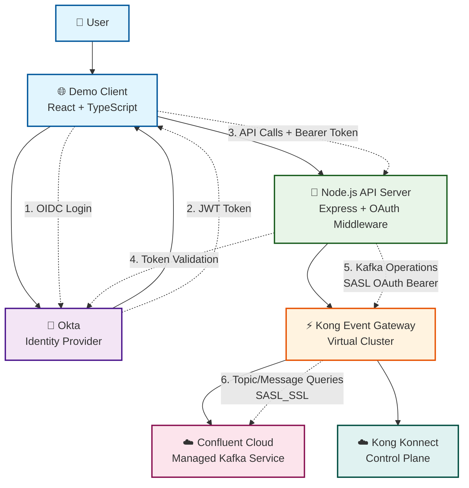
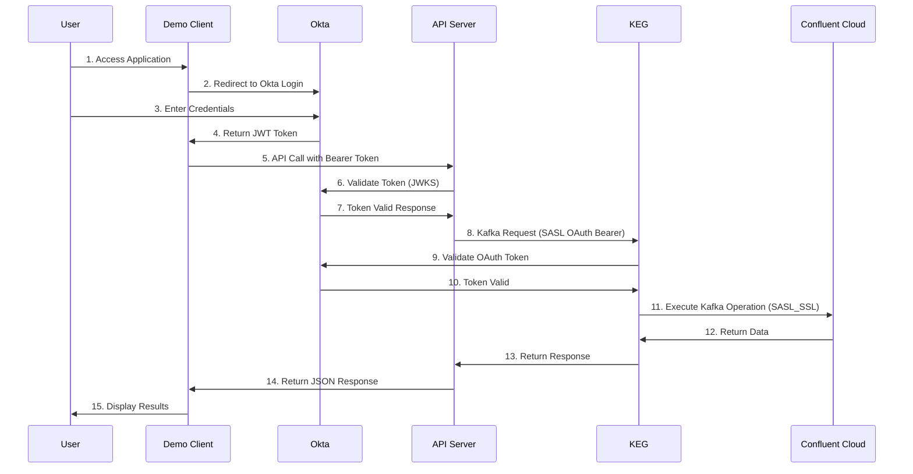
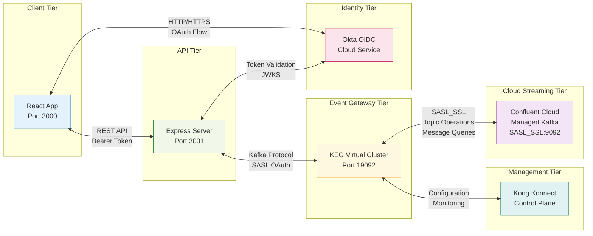
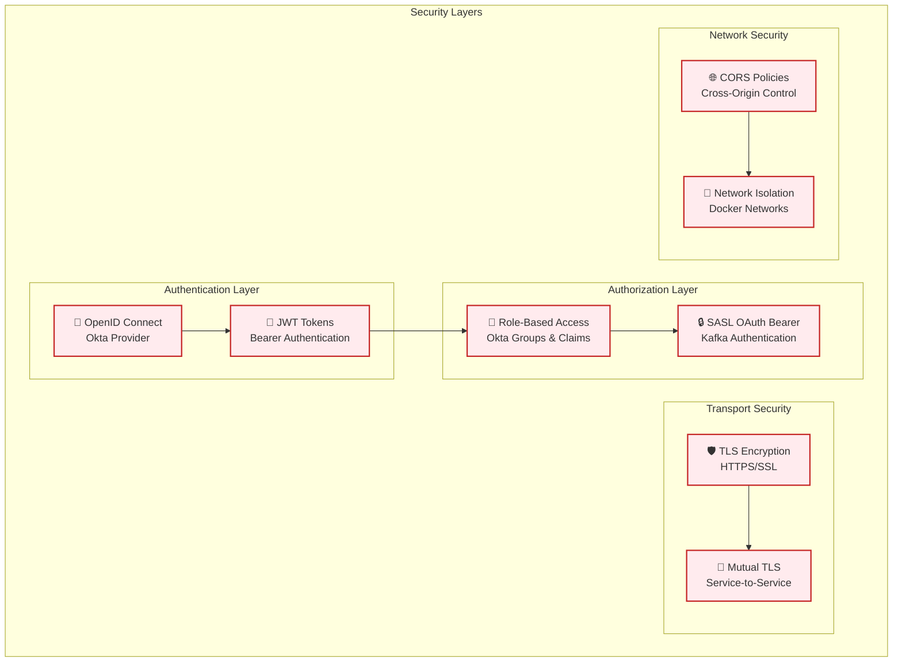
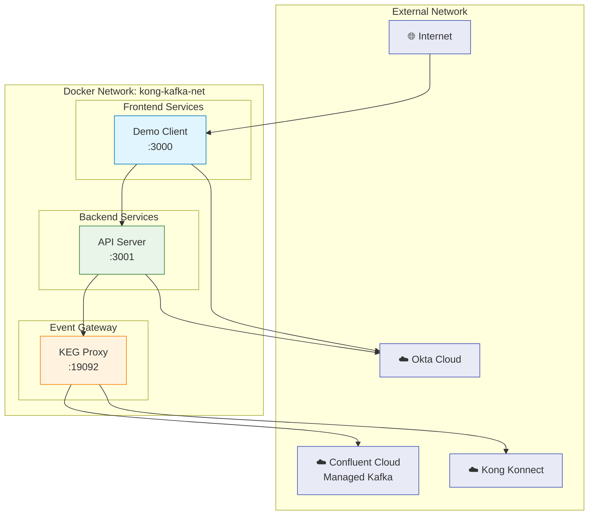

# Kong Event Gateway + Okta OAuth Demo

This repository demonstrates how to configure Kong Event Gateway to mediate authentication to a Kafka backend (Confluent Cloud or local) using OAuth with Okta as the identity provider.

## Overview

This demo showcases:
- Kong Event Gateway (KEG) native Kafka proxy configuration
- Okta OAuth 2.0 authentication with SASL OAuth Bearer
- **Two backend options**: Confluent Cloud (managed) or Local Kafka (docker-compose)
- Virtual cluster configuration with topic prefixing
- Secure cloud-to-cloud connectivity

## Backend Options

This demo supports two Kafka backend options:

| Backend | Description | Use Case |
|---------|-------------|----------|
| **Confluent Cloud** | Managed Kafka service in AWS/Azure/GCP | Production, cloud deployments |
| **Local Kafka** | Local Kafka cluster via Docker Compose | Development, testing, demos |

### Quick Comparison

| Feature | Confluent Cloud | Local Kafka |
|---------|-----------------|-------------|
| Authentication | SASL Plain (API Key/Secret) | None |
| TLS | Required | Optional (disabled by default) |
| Setup | Requires Confluent account | `docker-compose --profile local up` |
| Cost | Paid service | Free (local) |

## Architecture

This demo showcases a modern event-driven architecture with secure authentication and event streaming capabilities.


```mermaid
graph TB
    %% User and Client Layer
    User[👤 User] --> DemoClient[🌐 Demo Client<br/>React + TypeScript]

    %% Authentication Flow
    DemoClient --> Okta[🔐 Okta<br/>Identity Provider]
    Okta --> DemoClient

    %% API Gateway Layer
    DemoClient --> APIServer[🚀 Node.js API Server<br/>Express + OAuth Middleware]

    %% Kong Event Gateway Layer
    APIServer --> KEG[⚡ Kong Event Gateway<br/>Virtual Cluster]

    %% Confluent Cloud
    KEG --> ConfluentCloud[☁️ Confluent Cloud<br/>Managed Kafka Service]

    %% Kong Konnect Management
    KEG --> KongKonnect[☁️ Kong Konnect<br/>Control Plane]

    %% Data Flow Annotations
    DemoClient -.->|"1. OIDC Login"| Okta
    Okta -.->|"2. JWT Token"| DemoClient
    DemoClient -.->|"3. API Calls + Bearer Token"| APIServer
    APIServer -.->|"4. Token Validation"| Okta
    APIServer -.->|"5. Kafka Operations<br/>SASL OAuth Bearer"| KEG
    KEG -.->|"6. Topic/Message Queries<br/>SASL_SSL"| ConfluentCloud

    %% Styling
    classDef userLayer fill:#e1f5fe,stroke:#01579b,stroke-width:2px
    classDef authLayer fill:#f3e5f5,stroke:#4a148c,stroke-width:2px
    classDef appLayer fill:#e8f5e8,stroke:#1b5e20,stroke-width:2px
    classDef proxyLayer fill:#fff3e0,stroke:#e65100,stroke-width:2px
    classDef cloudLayer fill:#fce4ec,stroke:#880e4f,stroke-width:2px
    classDef mgmtLayer fill:#e0f2f1,stroke:#004d40,stroke-width:2px

    class User,DemoClient userLayer
    class Okta authLayer
    class APIServer appLayer
    class KEG proxyLayer
    class ConfluentCloud cloudLayer
    class KongKonnect mgmtLayer
```

### Component Details

| Component | Purpose | Technology | Port |
|-----------|---------|------------|------|
| **Demo Client** | Web UI for Kafka topic browsing | React + TypeScript + Material-UI | 3000 |
| **API Server** | Backend API with OAuth validation | Node.js + Express + Okta SDK | 3001 |
| **Okta** | Identity Provider & OAuth Server | Okta Cloud Service | - |
| **KEG** | Event Gateway & Native Kafka Proxy | Kong Event Gateway | 19092 |
| **Confluent Cloud** | Managed Kafka Service | Confluent Cloud | 9092 (SSL) |
| **Kong Konnect** | Control Plane Management | Kong Konnect Cloud | - |

### Authentication & Authorization Flow


```mermaid
sequenceDiagram
    participant U as User
    participant DC as Demo Client
    participant O as Okta
    participant API as API Server
    participant K as KEG
    participant CC as Confluent Cloud

    U->>DC: 1. Access Application
    DC->>O: 2. Redirect to Okta Login
    U->>O: 3. Enter Credentials
    O->>DC: 4. Return JWT Token
    DC->>API: 5. API Call with Bearer Token
    API->>O: 6. Validate Token (JWKS)
    O->>API: 7. Token Valid Response
    API->>K: 8. Kafka Request (SASL OAuth Bearer)
    K->>O: 9. Validate OAuth Token
    O->>K: 10. Token Valid
    K->>CC: 11. Execute Kafka Operation (SASL_SSL)
    CC->>K: 12. Return Data
    K->>API: 13. Return Response
    API->>DC: 14. Return JSON Response
    DC->>U: 15. Display Results
```

### Data Flow Architecture


```mermaid
flowchart LR
    subgraph "Client Tier"
        A[React App<br/>Port 3000]
    end

    subgraph "API Tier"
        B[Express Server<br/>Port 3001]
    end

    subgraph "Identity Tier"
        C[Okta OIDC<br/>Cloud Service]
    end

    subgraph "Event Gateway Tier"
        D[KEG Virtual Cluster<br/>Port 19092]
    end

    subgraph "Cloud Streaming Tier"
        E[Confluent Cloud<br/>Managed Kafka<br/>SASL_SSL:9092]
    end

    subgraph "Management Tier"
        F[Kong Konnect<br/>Control Plane]
    end

    A <-->|HTTP/HTTPS<br/>OAuth Flow| C
    A <-->|REST API<br/>Bearer Token| B
    B <-->|Token Validation<br/>JWKS| C
    B <-->|Kafka Protocol<br/>SASL OAuth| D
    D <-->|SASL_SSL<br/>Topic Operations<br/>Message Queries| E
    D <-->|Configuration<br/>Monitoring| F

    classDef client fill:#e3f2fd,stroke:#1976d2
    classDef api fill:#f1f8e9,stroke:#388e3c
    classDef auth fill:#fce4ec,stroke:#c2185b
    classDef gateway fill:#fff8e1,stroke:#f57c00
    classDef cloud fill:#f3e5f5,stroke:#7b1fa2
    classDef mgmt fill:#e0f2f1,stroke:#00695c

    class A client
    class B api
    class C auth
    class D gateway
    class E cloud
    class F mgmt
```

### Security Architecture


```mermaid
graph TB
    subgraph "Security Layers"
        subgraph "Authentication Layer"
            OIDC[🔐 OpenID Connect<br/>Okta Provider]
            JWT[🎫 JWT Tokens<br/>Bearer Authentication]
        end

        subgraph "Authorization Layer"
            RBAC[👥 Role-Based Access<br/>Okta Groups & Claims]
            SASL[🔒 SASL OAuth Bearer<br/>Kafka Authentication]
        end

        subgraph "Transport Security"
            TLS[🛡️ TLS Encryption<br/>HTTPS/SSL]
            MTLS[🔐 Mutual TLS<br/>Service-to-Service]
        end

        subgraph "Network Security"
            CORS[🌐 CORS Policies<br/>Cross-Origin Control]
            FW[🚧 Network Isolation<br/>Docker Networks]
        end
    end

    OIDC --> JWT
    JWT --> RBAC
    RBAC --> SASL
    TLS --> MTLS
    CORS --> FW

    classDef security fill:#ffebee,stroke:#c62828,stroke-width:2px
    class OIDC,JWT,RBAC,SASL,TLS,MTLS,CORS,FW security
```

### Network Topology


```mermaid
graph TB
    subgraph "External Network"
        Internet[🌐 Internet]
        OktaCloud[☁️ Okta Cloud]
        KonnectCloud[☁️ Kong Konnect]
        ConfluentCloud[☁️ Confluent Cloud<br/>Managed Kafka]
    end

    subgraph "Docker Network: kong-kafka-net"
        subgraph "Frontend Services"
            DemoApp[Demo Client<br/>:3000]
        end

        subgraph "Backend Services"
            APIGateway[API Server<br/>:3001]
        end

        subgraph "Event Gateway"
            KEG[KEG Proxy<br/>:19092]
        end
    end

    Internet --> DemoApp
    DemoApp --> OktaCloud
    DemoApp --> APIGateway
    APIGateway --> OktaCloud
    APIGateway --> KEG
    KEG --> KonnectCloud
    KEG --> ConfluentCloud

    classDef external fill:#e8eaf6,stroke:#3f51b5
    classDef frontend fill:#e1f5fe,stroke:#0277bd
    classDef backend fill:#e8f5e8,stroke:#2e7d32
    classDef gateway fill:#fff3e0,stroke:#f57c00

    class Internet,OktaCloud,KonnectCloud,ConfluentCloud external
    class DemoApp frontend
    class APIGateway backend
    class KEG gateway
```

### Key Architectural Benefits

| Benefit | Description | Implementation |
|---------|-------------|----------------|
| **🔐 Zero Trust Security** | Every request authenticated & authorized | Okta OIDC + SASL OAuth Bearer |
| **⚡ Event Gateway Pattern** | Unified API for event streaming | Kong Event Gateway (KEG) |
| **🏗️ Microservices Ready** | Loosely coupled, independently deployable | Docker containers + REST APIs |
| **📈 Managed Scalability** | Auto-scaling managed service | Confluent Cloud + Elastic scaling |
| **🛡️ Defense in Depth** | Multiple security layers | TLS + OAuth + RBAC + Cloud security |
| **🔄 Event-Driven Architecture** | Asynchronous, resilient communication | Kafka topics + Event sourcing patterns |
| **☁️ Cloud Native** | Fully managed cloud services | Confluent Cloud + Kong Konnect |
| **🎯 Developer Experience** | Modern tooling & type safety | TypeScript + Material-UI + Hot reload |

### Design Decisions

#### **Why Kong Event Gateway (KEG)?**
- **Unified API Surface**: Single gateway for both REST APIs and event streams
- **Enterprise Security**: OAuth Bearer token validation for Kafka access
- **Operational Simplicity**: Centralized monitoring, logging, and policy enforcement
- **Developer Productivity**: Familiar HTTP semantics for event streaming operations

#### **Why Okta for Identity?**
- **Enterprise Grade**: Production-ready identity and access management
- **Standards Compliant**: Full OpenID Connect and OAuth 2.0 support
- **Rich Ecosystem**: Extensive integrations and developer tools
- **Security First**: Advanced threat protection and compliance features

## Prerequisites

- Docker and Docker Compose
- Okta Account (for identity provider)
- Kong Konnect Account (for KEG)
- **Either** Confluent Cloud Account **or** local Docker (for Kafka)
- Basic understanding of Kafka and OAuth 2.0

## Deploying with Terraform

This repository includes Terraform configuration to deploy the Kong Event Gateway infrastructure to Kong Konnect.

### Choose Your Kafka Backend

#### Option 1: Confluent Cloud (Default)
```hcl
# terraform.tfvars
kafka_backend       = "confluent"
bootstrap_servers  = ["pkc-xxxxx.us-east-2.aws.confluent.cloud:9092"]
kafka_username     = "your-confluent-api-key"
kafka_password     = "your-confluent-api-secret"
```

#### Option 2: Local Kafka
```hcl
# terraform.tfvars
kafka_backend            = "local"
bootstrap_servers_local = ["localhost:9094"]
# kafka_username and kafka_password not required
```

### Terraform Structure

```
terraform/
├── versions.tf                 # Terraform and provider versions
├── main.tf                     # Root configuration
├── modules/
│   ├── event-gateway/          # Konnect Event Gateway resources
│   │   ├── main.tf
│   │   ├── variables.tf
│   │   └── outputs.tf
│   └── data-plane/            # Docker container for KEG data plane
│       ├── main.tf
│       └── ...
└── environments/
    └── dev/                    # Development environment
        ├── main.tf
        ├── variables.tf
        ├── providers.tf
        ├── versions.tf
        ├── terraform.tfvars
        └── terraform.tfvars.example
```

**What gets deployed:**
- Event Gateway, Backend Cluster, Virtual Cluster, Listeners, and Policies in Konnect
- TLS certificates registered in Konnect
- Docker container running Kong Event Gateway with certificate-based auth

### Deploy Steps

1. **Navigate to the Terraform environment directory**
   ```bash
   cd terraform/environments/dev
   ```

2. **Copy the example variables file**
   ```bash
   cp terraform.tfvars.example terraform.tfvars
   ```

3. **Edit `terraform.tfvars` with your credentials**
   ```hcl
   bootstrap_servers  = ["your-confluent-bootstrap-servers"]
   okta_jwks_endpoint = "https://your-org.okta.com/oauth2/v1/keys"
   kafka_username     = "your-confluent-api-key"
   kafka_password     = "your-confluent-api-secret"
   ```

4. **Set your Konnect Personal Access Token**
   ```bash
   export TF_VAR_konnect_token="your-konnect-pat"
   ```

5. **Initialize Terraform**
   ```bash
   terraform init
   ```

6. **Review the execution plan**
   ```bash
   terraform plan
   ```

7. **Apply the configuration**
   ```bash
   terraform apply
   ```

### Required Variables

| Variable | Description | Required | Backend |
|----------|-------------|----------|---------|
| `konnect_token` | Kong Konnect Personal Access Token (via `TF_VAR_konnect_token` env) | Yes | Both |
| `kafka_backend` | Backend type: `confluent` or `local` | No (default: `confluent`) | Both |
| `bootstrap_servers` | Confluent Cloud Bootstrap Servers | Yes (if `confluent`) | Confluent |
| `bootstrap_servers_local` | Local Kafka Bootstrap Servers | Yes (if `local`) | Local |
| `okta_jwks_endpoint` | Okta JWKS endpoint for OAuth validation | Yes | Both |
| `kafka_username` | Confluent Cloud API Key | Only if `confluent` | Confluent |
| `kafka_password` | Confluent Cloud API Secret | Only if `confluent` | Confluent |

### Output Values

After deployment, Terraform will output:
- `event_gateway_id` - The Event Gateway ID
- `event_gateway_name` - The Event Gateway name
- `virtual_cluster_id` - The Virtual Cluster ID
- `backend_cluster_id` - The Backend Cluster ID
- `data_plane_container_id` - The Docker container ID
- `data_plane_container_name` - The Docker container name

### Destroy Resources

To destroy all created resources:
```bash
terraform destroy
```

## Quick Start

1. **Clone the repository**
   ```bash
   git clone https://github.com/hguerrero/kong-event-gw-okta-demo.git
   cd kong-event-gw-okta-demo
   ```

2. **Choose your Kafka backend and configure Terraform**

   **For Confluent Cloud:**
   ```bash
   cp terraform/environments/dev/terraform.tfvars.example terraform/environments/dev/terraform.tfvars
   # Edit terraform.tfvars with kafka_backend = "confluent"
   ```

   **For Local Kafka:**
   ```bash
   cp terraform/environments/dev/terraform.tfvars.example terraform/environments/dev/terraform.tfvars
   # Edit terraform.tfvars with:
   # kafka_backend = "local"
   # bootstrap_servers_local = ["localhost:9094"]
   ```

3. **Deploy infrastructure with Terraform**
   ```bash
   cd terraform/environments/dev
   export TF_VAR_konnect_token="your-konnect-pat"
   terraform init
   terraform apply
   ```

4. **Start the Docker environment**
   
   **For Confluent Cloud:**
   ```bash
   docker-compose up -d
   ```

   **For Local Kafka:**
   ```bash
   docker-compose --profile local up -d
   ```

5. **Access the demo client application**
   
   ```bash
   http://localhost:3000
   ```

## Repository Structure

```
├── README.md                 # This file
├── docker-compose.yml        # Main Docker Compose configuration
├── .env.example              # Environment variables template
├── config/                   # Configuration files
│   ├── kong/                 # Kong Native Event Proxy configuration
│   │   └── config.yaml       # KEG virtual cluster configuration
│   └── certs/                # TLS certificates (if needed)
├── scripts/                  # Demo and utility scripts
├── demo-client/              # Demo web application
└── docs/                     # Additional documentation
```

## Configuration

### Kong Event Gateway (KEG)
- Virtual cluster configuration in `config/kong/config.yaml`
- SASL OAuth Bearer authentication
- Topic prefixing and routing
- Kafka backend integration (Confluent Cloud or Local)

### Okta OAuth
- OAuth 2.0 application setup
- JWKS endpoint configuration
- Token validation with SASL OAuth Bearer

### Kafka Backends

#### Confluent Cloud
- Fully managed Kafka service
- Enterprise-grade security and compliance
- Auto-scaling and global availability
- SASL_SSL authentication with API keys

#### Local Kafka
- Kafka cluster running locally via Docker Compose
- Enabled with `docker-compose --profile local up`
- No authentication by default
- TLS disabled for local development

## Usage

Detailed usage instructions can be found in the [docs/](docs/) directory:
- [Setup Guide](docs/setup.md)
- [Configuration Reference](docs/configuration.md)
- [Troubleshooting](docs/troubleshooting.md)

## Contributing

1. Fork the repository
2. Create a feature branch
3. Make your changes
4. Test thoroughly
5. Submit a pull request

## License

This project is licensed under the Apache License 2.0 - see the LICENSE file for details.

## Support

For questions and support:
- Check the [troubleshooting guide](docs/troubleshooting.md)
- Open an issue in this repository
- Refer to the official Kong and Okta documentation
