# Kong Event Gateway + Okta OAuth Demo

This repository demonstrates how to configure Kong Event Gateway to mediate authentication to Confluent Cloud using OAuth with Okta as the identity provider.

## Overview

This demo showcases:
- Kong Native Event Proxy (KNEP) configuration for Confluent Cloud integration
- Okta OAuth 2.0 authentication with SASL OAuth Bearer
- Confluent Cloud managed Kafka service
- Virtual cluster configuration with topic prefixing
- Secure cloud-to-cloud connectivity

## Architecture

This demo showcases a modern event-driven architecture with secure authentication and event streaming capabilities.


### Component Details

| Component | Purpose | Technology | Port |
|-----------|---------|------------|------|
| **Demo Client** | Web UI for Kafka topic browsing | React + TypeScript + Material-UI | 3000 |
| **API Server** | Backend API with OAuth validation | Node.js + Express + Okta SDK | 3001 |
| **Okta** | Identity Provider & OAuth Server | Okta Cloud Service | - |
| **KNEP** | Event Gateway & Kafka Proxy | Kong Native Event Proxy | 19092 |
| **Confluent Cloud** | Managed Kafka Service | Confluent Cloud | 9092 (SSL) |
| **Kong Konnect** | Control Plane Management | Kong Konnect Cloud | - |

### Authentication & Authorization Flow


### Data Flow Architecture


### Security Architecture

```mermaid
graph TB
    subgraph "Security Layers"
        subgraph "Authentication Layer"
            OIDC[🔐 OpenID Connect<br/>Okta Provider]
            JWT[🎫 JWT Tokens<br/>Bearer Authentication]
        end

        subgraph "Authorization Layer"
            RBAC[👥 Role-Based Access<br/>Okta Groups & Claims]
            SASL[🔒 SASL OAuth Bearer<br/>Kafka Authentication]
        end

        subgraph "Transport Security"
            TLS[🛡️ TLS Encryption<br/>HTTPS/SSL]
            MTLS[🔐 Mutual TLS<br/>Service-to-Service]
        end

        subgraph "Network Security"
            CORS[🌐 CORS Policies<br/>Cross-Origin Control]
            FW[🚧 Network Isolation<br/>Docker Networks]
        end
    end

    OIDC --> JWT
    JWT --> RBAC
    RBAC --> SASL
    TLS --> MTLS
    CORS --> FW

    classDef security fill:#ffebee,stroke:#c62828,stroke-width:2px
    class OIDC,JWT,RBAC,SASL,TLS,MTLS,CORS,FW security
```



### Network Topology

```mermaid
graph TB
    subgraph "External Network"
        Internet[🌐 Internet]
        OktaCloud[☁️ Okta Cloud]
        KonnectCloud[☁️ Kong Konnect]
        ConfluentCloud[☁️ Confluent Cloud<br/>Managed Kafka]
    end

    subgraph "Docker Network: kong-kafka-net"
        subgraph "Frontend Services"
            DemoApp[Demo Client<br/>:3000]
        end

        subgraph "Backend Services"
            APIGateway[API Server<br/>:3001]
        end

        subgraph "Event Gateway"
            KNEP[KNEP Proxy<br/>:19092]
        end
    end

    Internet --> DemoApp
    DemoApp --> OktaCloud
    DemoApp --> APIGateway
    APIGateway --> OktaCloud
    APIGateway --> KNEP
    KNEP --> KonnectCloud
    KNEP --> ConfluentCloud

    classDef external fill:#e8eaf6,stroke:#3f51b5
    classDef frontend fill:#e1f5fe,stroke:#0277bd
    classDef backend fill:#e8f5e8,stroke:#2e7d32
    classDef gateway fill:#fff3e0,stroke:#f57c00

    class Internet,OktaCloud,KonnectCloud,ConfluentCloud external
    class DemoApp frontend
    class APIGateway backend
    class KNEP gateway
```



### Key Architectural Benefits

| Benefit | Description | Implementation |
|---------|-------------|----------------|
| **🔐 Zero Trust Security** | Every request authenticated & authorized | Okta OIDC + SASL OAuth Bearer |
| **⚡ Event Gateway Pattern** | Unified API for event streaming | Kong Native Event Proxy (KNEP) |
| **🏗️ Microservices Ready** | Loosely coupled, independently deployable | Docker containers + REST APIs |
| **📈 Managed Scalability** | Auto-scaling managed service | Confluent Cloud + Elastic scaling |
| **🛡️ Defense in Depth** | Multiple security layers | TLS + OAuth + RBAC + Cloud security |
| **🔄 Event-Driven Architecture** | Asynchronous, resilient communication | Kafka topics + Event sourcing patterns |
| **☁️ Cloud Native** | Fully managed cloud services | Confluent Cloud + Kong Konnect |
| **🎯 Developer Experience** | Modern tooling & type safety | TypeScript + Material-UI + Hot reload |

### Design Decisions

#### **Why Kong Native Event Proxy (KNEP)?**
- **Unified API Surface**: Single gateway for both REST APIs and event streams
- **Enterprise Security**: OAuth Bearer token validation for Kafka access
- **Operational Simplicity**: Centralized monitoring, logging, and policy enforcement
- **Developer Productivity**: Familiar HTTP semantics for event streaming operations

#### **Why Okta for Identity?**
- **Enterprise Grade**: Production-ready identity and access management
- **Standards Compliant**: Full OpenID Connect and OAuth 2.0 support
- **Rich Ecosystem**: Extensive integrations and developer tools
- **Security First**: Advanced threat protection and compliance features

## Prerequisites

- Docker and Docker Compose
- Okta Account (for identity provider)
- Kong Konnect Account (for KNEP)
- Confluent Cloud Account (for managed Kafka)
- Basic understanding of Kafka and OAuth 2.0

## Quick Start

1. **Clone the repository**
   ```bash
   git clone https://github.com/hguerrero/kong-event-gw-okta-demo.git
   cd kong-event-gw-okta-demo
   ```

2. **Configure environment**
   - Copy `.env.example` to `.env`
   - Update with your Okta and Kong Konnect credentials
   - Add Confluent Cloud credentials to `config/secrets/` directory
   - See [Environment Variables Guide](docs/environment-variables.md) for detailed configuration
   - See [Confluent Cloud Setup](config/secrets/README.md) for authentication files

3. **Start the environment**
   ```bash
   docker-compose up -d
   ```

4. **Access the demo client application**
   
   ```bash
   http://localhost:3000
   ```

## Repository Structure

```
├── README.md                 # This file
├── docker-compose.yml        # Main Docker Compose configuration
├── .env.example              # Environment variables template
├── config/                   # Configuration files
│   ├── kong/                 # Kong Native Event Proxy configuration
│   │   └── config.yaml       # KNEP virtual cluster configuration
│   └── certs/                # TLS certificates (if needed)
├── scripts/                  # Demo and utility scripts
├── demo-client/              # Demo web application
└── docs/                     # Additional documentation
```

## Configuration

### Kong Native Event Proxy (KNEP)
- Virtual cluster configuration in `config/kong/config.yaml`
- SASL OAuth Bearer authentication
- Topic prefixing and routing
- Confluent Cloud integration with SASL_SSL

### Okta OAuth
- OAuth 2.0 application setup
- JWKS endpoint configuration
- Token validation with SASL OAuth Bearer

### Confluent Cloud
- Fully managed Kafka service
- Enterprise-grade security and compliance
- Auto-scaling and global availability
- SASL_SSL authentication with API keys

## Usage

Detailed usage instructions can be found in the [docs/](docs/) directory:
- [Setup Guide](docs/setup.md)
- [Configuration Reference](docs/configuration.md)
- [Troubleshooting](docs/troubleshooting.md)

## Contributing

1. Fork the repository
2. Create a feature branch
3. Make your changes
4. Test thoroughly
5. Submit a pull request

## License

This project is licensed under the Apache License 2.0 - see the LICENSE file for details.

## Support

For questions and support:
- Check the [troubleshooting guide](docs/troubleshooting.md)
- Open an issue in this repository
- Refer to the official Kong and Okta documentation
